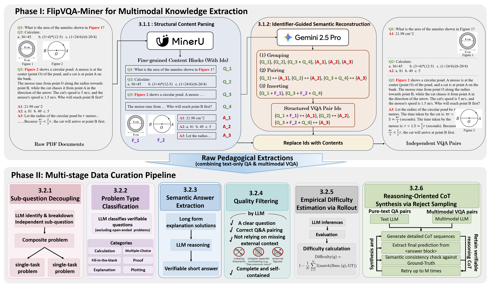

# DataFlow-VQA

从 PDF 教材和试卷中提取、清洗、生成思维链（CoT）数据的流水线工具。

[🤗数据集](https://huggingface.co/datasets/OpenDCAI/FlipVQA)

## 概览

DataFlow-VQA 通过三个顺序阶段处理 PDF 文件：

- 第一步（**Section 3.1：VQA 抽取**）：使用 [MinerU](https://github.com/opendatalab/MinerU) 进行文档版面分析，再用 LLM 从中抽取带图片的结构化问答对。
- 第二步（**Section 3.2.1 到 Section 3.2.5：数据清洗**）：对抽取到的问答对进行过滤和清洗——拆分小题、判断题型、抽取简洁答案、去除低质量内容。
- 第三步（**Section 3.2.6：生成 CoT**）：通过 Reject Sampling 生成思维链——LLM 生成回答，与标准答案核对，答错的重新生成。


## 安装

本项目基于 [DataFlow](https://github.com/OpenDCAI/DataFlow)，请先 clone 并安装：

```shell
git clone https://github.com/OpenDCAI/DataFlow.git
cd DataFlow
pip install -e ".[pdf2vqa]"
```

然后 clone 本仓库：

```shell
git clone <this-repo-url>
cd DataFlow-VQA
```

## 配置

### API 密钥

需要两个 API Key：

- `DF_API_KEY`：LLM 服务的 API Key（OpenAI、Google Gemini、DeepSeek 等均可）
- `MINERU_API_KEY`：[MinerU](https://mineru.net/apiManage/token) 文档版面解析的 API Key

```shell
export DF_API_KEY="sk-xxxxx"
export MINERU_API_KEY="sk2-xxxxx"
```

### LLM 端点

每个 pipeline 均支持 `--api_url` 和 `--model` 参数，可兼容任何 [OpenAI 兼容接口](https://platform.openai.com/docs/api-reference)（OpenAI、Gemini 代理、DeepSeek 等）。

`--api_url` 传入**基础 URL**（不含 `/chat/completions`），例如 `https://api.openai.com/v1`。

---

## 第一步：VQA 抽取

### 输入格式

创建一个 JSONL 文件，每行描述一个抽取任务：

```jsonl
{"input_pdf_paths": "./examples/VQA/questionextract_test.pdf", "name": "math1"}
{"input_pdf_paths": ["./examples/VQA/math_question.pdf", "./examples/VQA/math_answer.pdf"], "name": "math2"}
```

- `input_pdf_paths`：单个 PDF（题目和答案混排），或两个及更多的 PDF 的列表（题目pdf放在问题pdf前面）。
- `name`：该任务的唯一标识符（用于目录命名和缓存）。

### 运行

```bash
python -m pipelines.vqa_extract_optimized_pipeline \
    --input_file ./examples/VQA/vqa_extract_test.jsonl \
    --output_dir ./output \
    --api_url https://generativelanguage.googleapis.com/v1beta/openai/ \
    --model gemini-2.5-pro
```

**重要：** 我们推荐在这里使用强推理模型。较弱的模型比如`gpt-5-mini`在这一阶段可能表现较差。

### 输出

- `{output_dir}/raw_vqa.jsonl`：包含图片引用的问答对
- `{output_dir}/{name}/vqa_images/`：抽取出的图片
- `cache/{name}/`：中间文件（`extracted_vqa.jsonl`、`merged_qa_pairs.jsonl`、`merged_qa_pairs.md`）

每个 QA 条目包含：

```json
{
  "question": "计算 $x$ 使得 $x^2 - 1 = 0$。",
  "answer": "$x = 1$ 或 $x = -1$",
  "solution": "因式分解 $(x-1)(x+1)=0$。",
  "label": 1,
  "question_chapter_title": "第一章 二次方程",
  "answer_chapter_title": "第一章 二次方程",
  "image_basedir": "/path/to/your/images"
}
```

### 提示

**我们也支持使用本地 MinerU 部署**：在 `pipelines/vqa_extract_optimized_pipeline.py` 中替换算子：

```python
# 原版 opendatalab 本地版
self.mineru_executor = FileOrURLToMarkdownConverterLocal(
    intermediate_dir="intermediate",
    mineru_model_path="path/to/mineru/model",
)

# 加速版 Flash
self.mineru_executor = FileOrURLToMarkdownConverterFlash(
    intermediate_dir="intermediate",
    mineru_model_path="path/to/mineru/model",
    batch_size=4,
    replicas=1,
    num_gpus_per_replica=1,
    engine_gpu_util_rate_to_ray_cap=0.9,
)
```

详细参数参见 [DataFlow 的 MinerU 算子文档](https://github.com/OpenDCAI/DataFlow/blob/main/dataflow/operators/knowledge_cleaning/generate/mineru_operators.py)。

<details>
<summary>代码逻辑简介</summary>

抽取流水线共六步：

1. **PDF 合并**（`PDF_Merger`）：如果提供了多个 PDF，先合并为一个。
2. **文档版面解析**（`FileOrURLToMarkdownConverterAPI`）：调用 MinerU API，生成结构化版面 JSON 和页面图片。
3. **版面预处理**（`MinerU2LLMInputOperator`）：展平列表项并重新编号，生成 LLM 输入格式。
4. **LLM 抽取**（`ChunkedPromptedGenerator`）：将版面 JSON 分块（每块最多 128k token），用 `QAExtractPrompt` 提示词批量调用 LLM，生成 XML 格式的问答对。
5. **输出解析**（`LLMOutputParser`）：将 XML 响应解析为 JSONL，并将图片复制到 `vqa_images/`。
6. **问答合并**（`QA_Merger`）：对于题目和答案分离的 PDF，根据章节标题和题目序号进行启发式匹配。可以设置一个strict_title_match参数，如果设置为True，会对章节标题进行严格匹配，否则会尝试提取标题中的中文/英文序号再匹配。

</details>

---

## 第二步：数据清洗

```bash
python -m pipelines.curate_data \
    --input_file ./output/raw_vqa.jsonl \
    --api_url https://api.openai.com/v1 \
    --model gpt-5-mini
```

输出保存为 `--input_file` 同目录下的 `curated_vqa.jsonl`。

<details>
<summary>代码逻辑简介</summary>

共四步：

**1. 切小题**

将含多个独立小问的题目（如 (a)(b)(c)）拆分为独立条目，每个小题配上对应的答案和解析。question 或 answer+solution 均为空的条目会被丢弃。

题目内的小问如果互相有联系（比如(b)需要(a)的结果），则不会拆分为独立条目。

新增字段：`split_qa`

**2. 判断题型**

将每道题归类为以下之一：`Calculation`、`Proof`、`Explanation`、`Fill-in`、`Multiple-choice`、`Sketching`、`Other`。

默认只保留 `Calculation`、`Fill-in`、`Multiple-choice`。可通过修改 `DataCurationPipeline.__init__` 中的 `filter_rules` 自定义保留范围。

新增字段：`type`、`type_reason`

**3. 抽取答案**

从 `solution` 字段中抽取简洁答案并写入 `answer`。如 `answer` 已有内容则跳过（可在 `AnswerExtractionOperator` 中设置 `overwrite=True` 覆盖）。

**4. 题目过滤**

过滤掉不符合要求的条目，标准包括：

- 必须是明确的考题，不能是示例、纯陈述或开放性讨论。
- 答案必须直接回答问题。
- 题目和答案须自洽完整，不能依赖外部引用或省略的上下文。

新增字段：`filter_result`、`filter_reason`

</details>

---

## 第三步：生成 CoT

答题模型和评判模型可以使用不同的 API 端点和 API Key，这在答题模型是本地部署的开源 VLM（如通过 vLLM 部署的 Qwen3-VL）而评判模型是商业 API 时非常实用。

使用 `--answer_api_key_env` / `--judge_api_key_env` 指定各自使用哪个环境变量作为 API Key（默认均为 `DF_API_KEY`）。

```bash
# 示例：本地 Qwen3-VL 生成答案，OpenAI 作为评判
export VLLM_API_KEY="token-xxxx"   # 如果 vLLM server 不需要 key 可以不设
export DF_API_KEY="sk-xxxx"

python -m pipelines.generate_cot \
    --input_file ./output/curated_vqa.jsonl \
    --max_retries 5 \
    --answer_api_url https://your-vllm-server/v1 \
    --answer_model qwen3-vl-235b-thinking \
    --answer_api_key_env VLLM_API_KEY \
    --judge_api_url https://api.openai.com/v1 \
    --judge_model gpt-5-mini \
    --judge_api_key_env DF_API_KEY
```

输出保存为 `--input_file` 同目录下的 `curated_vqa_with_cot.jsonl`。

<details>
<summary>代码逻辑简介</summary>

在最多 `max_retries` 轮中进行 Reject Sampling：

**1. LLM 回答**（`VQAReasoningAnswerGenerator`）

LLM 生成分步推理过程，结果存入 `generated_cot`。在 `RejectSamplingPipeline` 中设置 `skip_text_only=True` 可只处理包含图片的题目，`False` 则处理全部题目。

**2. 清理 thinking 内容**

从生成结果中删除 `<think>...</think>` 部分以降低验证成本。清理后的答案存入 `llm_short_answer`。假设模型输出格式为 `<think>THINK</think>ANSWER`或`THINK</think>ANSWER`。

**3. LLM 核对**（`BenchDatasetEvaluatorQuestion`）

将 `llm_short_answer` 与标准答案 `answer` 进行语义比较（数值允许 5% 误差）。答对的标记为 `answer_match_result = True`，后续轮次跳过。

设置 `support_subquestions=True` 会逐个评估小题，只要有一道答错，整题的 `answer_match_result` 即为 `False`。

评估统计（整体正确率、小题正确率）保存至 `./cot_cache/eval_results.jsonl`：

```json
{
  "total_samples": 23584,
  "matched_samples": 12281,
  "accuracy": 0.521,
  "total_subquestions": 26380,
  "correct_subquestions": 13807,
  "subquestion_accuracy": 0.523
}
```

</details>

---

## 示例

`examples/VQA/` 目录提供了示例 PDF 和输入 JSONL：

```
examples/VQA/
├── vqa_extract_test.jsonl    # 第一步的示例输入
├── questionextract_test.pdf  # 题目答案混排 PDF
├── math_question.pdf         # 题目 PDF（分离式示例）
└── math_answer.pdf           # 答案 PDF（分离式示例）
```

完整流水线示例：

```bash
# 第一步：抽取
python -m pipelines.vqa_extract_optimized_pipeline \
    --input_file ./examples/VQA/vqa_extract_test.jsonl \
    --output_dir ./output \
    --api_url https://generativelanguage.googleapis.com/v1beta/openai/ \
    --model gemini-2.5-pro

# 第二步：清洗
python -m pipelines.curate_data \
    --input_file ./output/raw_vqa.jsonl \
    --api_url https://api.openai.com/v1 \
    --model gpt-5-mini

# 第三步：生成 CoT
# 示例：本地 Qwen3-VL 生成答案，OpenAI 作为评判
export VLLM_API_KEY="token-xxxx"   # 如果 vLLM server 不需要 key 可以不设
export DF_API_KEY="sk-xxxx"

python -m pipelines.generate_cot \
    --input_file ./output/curated_vqa.jsonl \
    --max_retries 5 \
    --answer_api_url https://your-vllm-server/v1 \
    --answer_model qwen3-vl-235b-thinking \
    --answer_api_key_env VLLM_API_KEY \
    --judge_api_url https://api.openai.com/v1 \
    --judge_model gpt-5-mini \
    --judge_api_key_env DF_API_KEY
```

## 提示
目前的实现版本仅使用于跑小规模的示例。如果你想用我们的方法处理大规模的书籍，你应该会需要[断点续传](https://opendcai.github.io/DataFlow-Doc/zh/guide/resume/)和[分批推理](https://opendcai.github.io/DataFlow-Doc/en/guide/batch/)这两个feature。

## 许可证

本项目基于 [Apache License 2.0](LICENSE) 开源。
